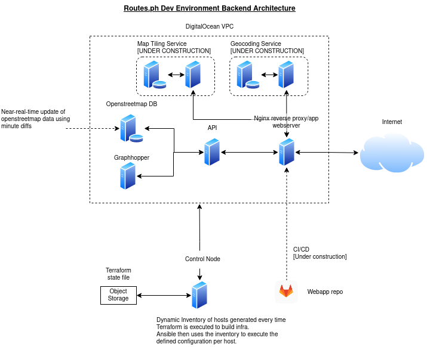

# Routes.ph Development Environment

The backend services consists of a traditional 3-tier backend architecture + additional microservices for the geoservice and map tile services. The objective of this project is to streamline the provisioning and tear-down of infrastructure to save on development costs. 

Provisioning of the hosts and automation of the config of each service (Openstreetmap DB, routing engine, API, reverse proxy and webserver) take approximately 15-20 minutes. This includes the loading of the latest Philippine Openstreetmap data from [Geofabrik](http://download.geofabrik.de/asia/philippines-latest.osm.pbf).

## Architecture

